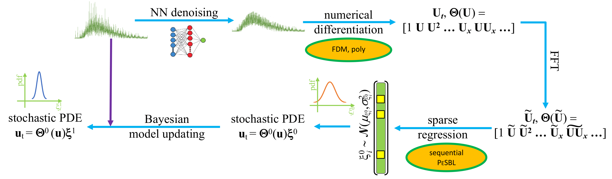

# PeSBL_PDE_Learning
A robust method of learning stochastic PDEs from dynamical systems.

Copyright Notice:

Authors: Zhiming Zhang zzhan506@asu.edu; Yongming Liu yongming.liu@asu.edu

Preprint: Parsimony-Enhanced Sparse Bayesian Learning for Robust Discovery of Partial Differential Equations. https://arxiv.org/abs/2102.06504

Prognostic Analysis and Reliability Assessment Lab, Arizona State University. https://paralab.engineering.asu.edu/
